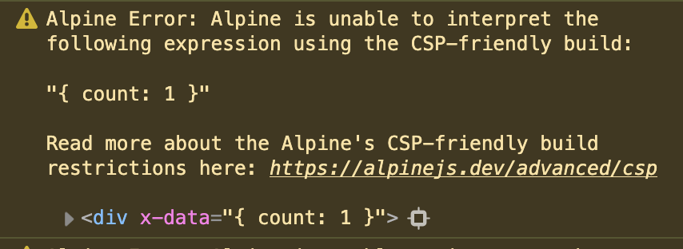

## Overview
I have been working on several Alpine.js projects lately that require the CSP build (Content-Security Policy) for security reasons and wanted to share some tips and tricks I've learned along the way. 

To learn more about how to set up Alpine's CSP build and why you might want to use it, check out my previous article: [How to set up Alpine.js using the CSP build](/posts/setting-up-alpinejs-csp-build).

## Major differences between regular Alpine.js and the CSP build
The biggest difference when using the CSP build is that Alpine.js can't intrepret strings in your markup as JavaScript. 

For example, this won't work:
```html
<!-- Nope! ❌ -->
<div x-data="{ count: 1 }">
    <button @click="count++">Increment</button>
 
    <span x-text="count"></span>
</div>
```

Instead, you will have to reference your `x-data` as an Alpine.js component in JavaScript directly. Also, you'll have to update your `count++` expression to a named method called `increment` that will handle the logic. 
```html
<!-- Yep! ✅ -->
<div x-data="counter">
    <button @click="increment">Increment</button>
 
    <span x-text="count"></span>
</div>
```

And in your JavaScript:
```javascript
// Yep! ✅ 
Alpine.data('counter', () => ({
    count: 1,
 
    increment() {
        this.count++
    },
}))
```

So the TL;DR is, you can't use JavaScript (for the most part) in your markup! If you do, you will get a warning in your console like this:



## *Dot-notation is allowed 
You can however, use dot-notation when accessing nested properties in your component, or when you are looping over an array of objects like so:

```html
<div x-data="Product">
  <div x-for="product in products">
    <div x-text="product.name"></div>
    <div x-text="product.uuid"></div>
    <div x-text="product.price"></div>
  </div>
</div>
```

```javascript
Alpine.data('Product', () => ({
    products: [
      {
        name: 'T-Shirt',
        uuid: '123',
        price: '$20',
      },
      {
        name: 'Jean Jacket',
        uuid: '456',
        price: '$50',
      },
      {
        name: 'Jeans',
        uuid: '789',
        price: '$80',
      }
    ]
}))
```

## You can't use `x-model`
At the time of writing, the Alpine.js CSP documentation doesn't explicity mention this, but I've never gotten `x-model` to work. There are some open issues in Github explaining the issue: [ x-model doesn't work in the CSP build #1849 ](https://github.com/alpinejs/alpine/discussions/1849)

As a user points out, you can acheive a similar result by doing the following:

```html
<div x-data="Profile">
  <input :value="username" @input="setUsername">
</div>
```

```javascript
Alpine.data('Profile', () => ({
    username: '',

    setUsername() {
      this.username = this.$event.value
    }
}))
```

## x-id


## Writing Alpine.js code in it's own JavaScript file

## Handling conditionals

## Binding attributes

## Passing properties 